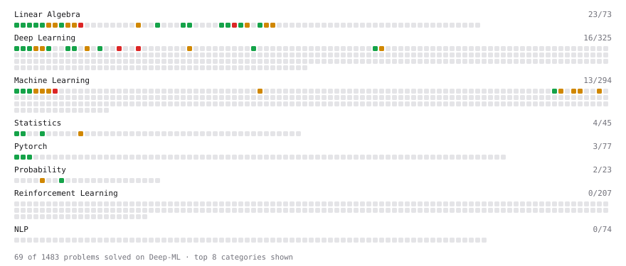

# Deep-ML

My machine learning practice from [Deep-ML](https://www.deep-ml.com). Every solution here was written by hand.

**102** solved · 72 problems · 1 labs · 29 math

[**Browse the interactive portfolio**](https://leoyang429.github.io/deep-ml/) to replay this filling in over time.

## Problems

| | Difficulty | Solved | |
| --- | --- | --- | --- |
| [Add a Bias Vector to a Batch via Broadcasting](https://www.deep-ml.com/problems/882) | easy | 2026-09-30 | [solution](problems/0882-add-a-bias-vector-to-a-batch-via-broadcasting) |
| [Calculate 2x2 Matrix Inverse](https://www.deep-ml.com/problems/8) | easy | 2026-02-11 | [solution](problems/0008-calculate-2x2-matrix-inverse) |
| [Calculate Cosine Similarity Between Vectors](https://www.deep-ml.com/problems/76) | easy | 2026-09-03 | [solution](problems/0076-calculate-cosine-similarity-between-vectors) |
| [Calculate Covariance Matrix](https://www.deep-ml.com/problems/10) | easy | 2026-02-11 | [solution](problems/0010-calculate-covariance-matrix) |
| [Calculate Mean by Row or Column](https://www.deep-ml.com/problems/4) | easy | 2026-02-10 | [solution](problems/0004-calculate-mean-by-row-or-column) |
| [Check Linear Independence of Vectors](https://www.deep-ml.com/problems/331) | easy | 2026-09-08 | [solution](problems/0331-check-linear-independence-of-vectors) |
| [Compute a Gradient with PyTorch Autograd](https://www.deep-ml.com/problems/884) | easy | 2026-09-30 | [solution](problems/0884-compute-a-gradient-with-pytorch-autograd) |
| [Compute Multi-class Cross-Entropy Loss](https://www.deep-ml.com/problems/134) | easy | 2026-09-30 | [solution](problems/0134-compute-multi-class-cross-entropy-loss) |
| [Create a Float Tensor from a Python List](https://www.deep-ml.com/problems/880) | easy | 2026-09-30 | [solution](problems/0880-create-a-float-tensor-from-a-python-list) |
| [Derivative of a Polynomial](https://www.deep-ml.com/problems/116) | easy | 2026-08-01 | [solution](problems/0116-derivative-of-a-polynomial) |
| [Derivatives of Activation Functions](https://www.deep-ml.com/problems/217) | easy | 2026-09-08 | [solution](problems/0217-derivatives-of-activation-functions) |
| [Descriptive Statistics Calculator](https://www.deep-ml.com/problems/78) | easy | 2026-09-04 | [solution](problems/0078-descriptive-statistics-calculator) |
| [Dot Product Calculator](https://www.deep-ml.com/problems/83) | easy | 2026-09-03 | [solution](problems/0083-dot-product-calculator) |
| [Empirical Probability Mass Function (PMF)](https://www.deep-ml.com/problems/184) | easy | 2026-09-04 | [solution](problems/0184-empirical-probability-mass-function-pmf) |
| [Expected Value and Variance of an n-Sided Die](https://www.deep-ml.com/problems/179) | easy | 2026-09-04 | [solution](problems/0179-expected-value-and-variance-of-an-n-sided-die) |
| [Feature Scaling Implementation](https://www.deep-ml.com/problems/16) | easy | 2026-02-25 | [solution](problems/0016-feature-scaling-implementation) |
| [Gradient Direction and Magnitude](https://www.deep-ml.com/problems/308) | easy | 2026-08-02 | [solution](problems/0308-gradient-direction-and-magnitude) |
| [Implement a Linear Layer Forward Pass with Matrix Multiplication](https://www.deep-ml.com/problems/883) | easy | 2026-09-30 | [solution](problems/0883-implement-a-linear-layer-forward-pass-with-matrix-multiplication) |
| [Implement Orthogonal Projection of a Vector onto a Line](https://www.deep-ml.com/problems/66) | easy | 2026-09-08 | [solution](problems/0066-implement-orthogonal-projection-of-a-vector-onto-a-line) |
| [Implement ReLU Activation Function](https://www.deep-ml.com/problems/42) | easy | 2026-09-30 | [solution](problems/0042-implement-relu-activation-function) |
| [Implementation of Log Softmax Function](https://www.deep-ml.com/problems/39) | easy | 2026-09-30 | [solution](problems/0039-implementation-of-log-softmax-function) |
| [KL Divergence Between Two Normal Distributions](https://www.deep-ml.com/problems/56) | easy | 2026-09-29 | [solution](problems/0056-kl-divergence-between-two-normal-distributions) |
| [Leaky ReLU Activation Function](https://www.deep-ml.com/problems/44) | easy | 2026-09-30 | [solution](problems/0044-leaky-relu-activation-function) |
| [Linear Regression Using Gradient Descent](https://www.deep-ml.com/problems/15) | easy | 2026-02-24 | [solution](problems/0015-linear-regression-using-gradient-descent) |
| [Linear Regression Using Normal Equation](https://www.deep-ml.com/problems/14) | easy | 2026-02-24 | [solution](problems/0014-linear-regression-using-normal-equation) |
| [Matrix Determinant & Trace](https://www.deep-ml.com/problems/195) | easy | 2026-09-08 | [solution](problems/0195-matrix-determinant-trace) |
| [Matrix-Vector Dot Product](https://www.deep-ml.com/problems/1) | easy | 2026-02-10 | [solution](problems/0001-matrix-vector-dot-product) |
| [Reshape and Transpose a Tensor](https://www.deep-ml.com/problems/881) | easy | 2026-09-30 | [solution](problems/0881-reshape-and-transpose-a-tensor) |
| [Reshape Matrix](https://www.deep-ml.com/problems/3) | easy | 2026-02-10 | [solution](problems/0003-reshape-matrix) |
| [Scalar Multiplication of a Matrix](https://www.deep-ml.com/problems/5) | easy | 2026-02-10 | [solution](problems/0005-scalar-multiplication-of-a-matrix) |
| [Sigmoid Activation Function Understanding](https://www.deep-ml.com/problems/22) | easy | 2026-03-06 | [solution](problems/0022-sigmoid-activation-function-understanding) |
| [Single Linear Neuron Forward](https://www.deep-ml.com/problems/1224) | easy | 2026-09-30 | [solution](problems/1224-single-linear-neuron-forward) |
| [Single Neuron](https://www.deep-ml.com/problems/24) | easy | 2026-03-06 | [solution](problems/0024-single-neuron) |
| [Softmax Activation Function Implementation ](https://www.deep-ml.com/problems/23) | easy | 2026-03-06 | [solution](problems/0023-softmax-activation-function-implementation) |
| [Transpose of a Matrix](https://www.deep-ml.com/problems/2) | easy | 2026-02-10 | [solution](problems/0002-transpose-of-a-matrix) |
| [Vector Element-wise Sum](https://www.deep-ml.com/problems/121) | easy | 2026-09-03 | [solution](problems/0121-vector-element-wise-sum) |
| [Vector Norms (L1/L2/L-inf) and the Frobenius Norm](https://www.deep-ml.com/problems/328) | easy | 2026-09-03 | [solution](problems/0328-vector-norms-l1-l2-l-inf-and-the-frobenius-norm) |
| [Calculate Eigenvalues of a Matrix](https://www.deep-ml.com/problems/6) | medium | 2026-02-10 | [solution](problems/0006-calculate-eigenvalues-of-a-matrix) |
| [Calculate KL Divergence Between Two Multivariate Gaussian Distributions](https://www.deep-ml.com/problems/136) | medium | 2026-09-29 | [solution](problems/0136-calculate-kl-divergence-between-two-multivariate-gaussian-distributions) |
| [Chain Rule for Composite Functions](https://www.deep-ml.com/problems/214) | medium | 2026-08-02 | [solution](problems/0214-chain-rule-for-composite-functions) |
| [Check if Matrix is Positive Definite](https://www.deep-ml.com/problems/332) | medium | 2026-09-29 | [solution](problems/0332-check-if-matrix-is-positive-definite) |
| [Classify Critical Points Using Hessian Eigenvalues](https://www.deep-ml.com/problems/311) | medium | 2026-09-29 | [solution](problems/0311-classify-critical-points-using-hessian-eigenvalues) |
| [Compute the Hessian Matrix](https://www.deep-ml.com/problems/218) | medium | 2026-09-29 | [solution](problems/0218-compute-the-hessian-matrix) |
| [Derivative of Cross-Entropy Loss w.r.t. Logits](https://www.deep-ml.com/problems/220) | medium | 2026-09-08 | [solution](problems/0220-derivative-of-cross-entropy-loss-w-r-t-logits) |
| [Derivative of Softmax](https://www.deep-ml.com/problems/219) | medium | 2026-09-08 | [solution](problems/0219-derivative-of-softmax) |
| [Entropy & Cross-Entropy](https://www.deep-ml.com/problems/205) | medium | 2026-09-29 | [solution](problems/0205-entropy-cross-entropy) |
| [Gaussian Elimination for Solving Linear Systems](https://www.deep-ml.com/problems/58) | medium | 2026-09-08 | [solution](problems/0058-gaussian-elimination-for-solving-linear-systems) |
| [Implement K-Fold Cross-Validation](https://www.deep-ml.com/problems/18) | medium | 2026-03-05 | [solution](problems/0018-implement-k-fold-cross-validation) |
| [Implement Layer Normalization for Sequence Data](https://www.deep-ml.com/problems/109) | medium | 2026-03-24 | [solution](problems/0109-implement-layer-normalization-for-sequence-data) |
| [Implement Masked Self-Attention](https://www.deep-ml.com/problems/107) | medium | 2026-03-24 | [solution](problems/0107-implement-masked-self-attention) |
| [Implement Self-Attention Mechanism](https://www.deep-ml.com/problems/53) | medium | 2026-03-18 | [solution](problems/0053-implement-self-attention-mechanism) |
| [Implementing Basic Autograd Operations](https://www.deep-ml.com/problems/26) | medium | 2026-03-26 | [solution](problems/0026-implementing-basic-autograd-operations) |
| [Jacobian Matrix Calculation](https://www.deep-ml.com/problems/202) | medium | 2026-09-08 | [solution](problems/0202-jacobian-matrix-calculation) |
| [K-Means Clustering](https://www.deep-ml.com/problems/17) | medium | 2026-03-04 | [solution](problems/0017-k-means-clustering) |
| [LU Decomposition of a Square Matrix](https://www.deep-ml.com/problems/333) | medium | 2026-09-29 | [solution](problems/0333-lu-decomposition-of-a-square-matrix) |
| [Matrix Rank](https://www.deep-ml.com/problems/329) | medium | 2026-09-08 | [solution](problems/0329-matrix-rank) |
| [Matrix times Matrix ](https://www.deep-ml.com/problems/9) | medium | 2026-02-11 | [solution](problems/0009-matrix-times-matrix) |
| [Matrix Transformation ](https://www.deep-ml.com/problems/7) | medium | 2026-02-11 | [solution](problems/0007-matrix-transformation) |
| [Maximum A Posteriori (MAP) Estimation for Bernoulli Parameter](https://www.deep-ml.com/problems/338) | medium | 2026-09-29 | [solution](problems/0338-maximum-a-posteriori-map-estimation-for-bernoulli-parameter) |
| [Maximum Likelihood Estimation for Gaussian Distribution](https://www.deep-ml.com/problems/337) | medium | 2026-09-29 | [solution](problems/0337-maximum-likelihood-estimation-for-gaussian-distribution) |
| [Numerical Gradient Checking](https://www.deep-ml.com/problems/313) | medium | 2026-09-08 | [solution](problems/0313-numerical-gradient-checking) |
| [Partial Derivatives of Multivariable Functions](https://www.deep-ml.com/problems/215) | medium | 2026-08-02 | [solution](problems/0215-partial-derivatives-of-multivariable-functions) |
| [Principal Component Analysis (PCA) Implementation](https://www.deep-ml.com/problems/19) | medium | 2026-03-05 | [solution](problems/0019-principal-component-analysis-pca-implementation) |
| [Product Rule for Derivatives](https://www.deep-ml.com/problems/309) | medium | 2026-08-01 | [solution](problems/0309-product-rule-for-derivatives) |
| [Quotient Rule for Derivatives](https://www.deep-ml.com/problems/312) | medium | 2026-08-02 | [solution](problems/0312-quotient-rule-for-derivatives) |
| [Single Neuron with Backpropagation](https://www.deep-ml.com/problems/25) | medium | 2026-03-06 | [solution](problems/0025-single-neuron-with-backpropagation) |
| [Solve Linear Equations using Jacobi Method](https://www.deep-ml.com/problems/11) | medium | 2026-02-11 | [solution](problems/0011-solve-linear-equations-using-jacobi-method) |
| [Decision Tree Learning](https://www.deep-ml.com/problems/20) | hard | 2026-03-05 | [solution](problems/0020-decision-tree-learning) |
| [Implement Multi-Head Attention](https://www.deep-ml.com/problems/94) | hard | 2026-03-24 | [solution](problems/0094-implement-multi-head-attention) |
| [Positional Encoding Calculator](https://www.deep-ml.com/problems/85) | hard | 2026-03-24 | [solution](problems/0085-positional-encoding-calculator) |
| [QR Decomposition](https://www.deep-ml.com/problems/201) | hard | 2026-09-29 | [solution](problems/0201-qr-decomposition) |
| [Singular Value Decomposition (SVD) of 2x2 Matrix](https://www.deep-ml.com/problems/12) | hard | 2026-09-29 | [solution](problems/0012-singular-value-decomposition-svd-of-2x2-matrix) |

## Labs

| | Difficulty | Solved | |
| --- | --- | --- | --- |
| [Design Your Own Activation Function](https://www.deep-ml.com/labs/9) | easy | 2026-09-30 | [solution](labs/0009-design-your-own-activation-function) |

## Math

| | Difficulty | Solved | |
| --- | --- | --- | --- |
| [Derivatives and Gradients](https://www.deep-ml.com/math-problems/1) | easy | 2026-08-01 | [solution](math/0001-derivatives-and-gradients) |
| [Descriptive Statistics](https://www.deep-ml.com/math-problems/18) | easy | 2026-09-04 | [solution](math/0018-descriptive-statistics) |
| [Expectation and Variance Algebra](https://www.deep-ml.com/math-problems/33) | easy | 2026-09-04 | [solution](math/0033-expectation-and-variance-algebra) |
| [Gradient Descent Updates](https://www.deep-ml.com/math-problems/5) | easy | 2026-09-03 | [solution](math/0005-gradient-descent-updates) |
| [Matrix Basics](https://www.deep-ml.com/math-problems/9) | easy | 2026-09-03 | [solution](math/0009-matrix-basics) |
| [Probability Fundamentals](https://www.deep-ml.com/math-problems/19) | easy | 2026-09-04 | [solution](math/0019-probability-fundamentals) |
| [Vector Operations](https://www.deep-ml.com/math-problems/7) | easy | 2026-09-03 | [solution](math/0007-vector-operations) |
| [Backpropagation and the Chain Rule](https://www.deep-ml.com/math-problems/4) | medium | 2026-09-08 | [solution](math/0004-backpropagation-and-the-chain-rule) |
| [Covariance and Correlation](https://www.deep-ml.com/math-problems/17) | medium | 2026-09-08 | [solution](math/0017-covariance-and-correlation) |
| [Determinants and Trace](https://www.deep-ml.com/math-problems/11) | medium | 2026-09-06 | [solution](math/0011-determinants-and-trace) |
| [Information Theory: Entropy](https://www.deep-ml.com/math-problems/24) | medium | 2026-09-29 | [solution](math/0024-information-theory-entropy) |
| [Inverse and Rank](https://www.deep-ml.com/math-problems/12) | medium | 2026-09-06 | [solution](math/0012-inverse-and-rank) |
| [Least Squares and the Normal Equations](https://www.deep-ml.com/math-problems/34) | medium | 2026-09-08 | [solution](math/0034-least-squares-and-the-normal-equations) |
| [Log-Likelihood Gradients](https://www.deep-ml.com/math-problems/38) | medium | 2026-09-29 | [solution](math/0038-log-likelihood-gradients) |
| [Matrix Calculus Identities](https://www.deep-ml.com/math-problems/35) | medium | 2026-09-08 | [solution](math/0035-matrix-calculus-identities) |
| [Matrix Multiplication](https://www.deep-ml.com/math-problems/10) | medium | 2026-09-03 | [solution](math/0010-matrix-multiplication) |
| [Multivariate Calculus](https://www.deep-ml.com/math-problems/2) | medium | 2026-08-02 | [solution](math/0002-multivariate-calculus) |
| [Neural Network Derivatives](https://www.deep-ml.com/math-problems/3) | medium | 2026-09-08 | [solution](math/0003-neural-network-derivatives) |
| [Optimization: Convexity and Critical Points](https://www.deep-ml.com/math-problems/6) | medium | 2026-09-29 | [solution](math/0006-optimization-convexity-and-critical-points) |
| [Orthogonality and Projections](https://www.deep-ml.com/math-problems/14) | medium | 2026-09-06 | [solution](math/0014-orthogonality-and-projections) |
| [Regularization and Generalization](https://www.deep-ml.com/math-problems/31) | medium | 2026-09-29 | [solution](math/0031-regularization-and-generalization) |
| [Softmax and Cross-Entropy](https://www.deep-ml.com/math-problems/32) | medium | 2026-09-08 | [solution](math/0032-softmax-and-cross-entropy) |
| [Solving Linear Systems](https://www.deep-ml.com/math-problems/13) | medium | 2026-09-06 | [solution](math/0013-solving-linear-systems) |
| [Taylor Expansions and Local Quadratic Models](https://www.deep-ml.com/math-problems/37) | medium | 2026-09-29 | [solution](math/0037-taylor-expansions-and-local-quadratic-models) |
| [Vector Norms and Linear Independence](https://www.deep-ml.com/math-problems/8) | medium | 2026-09-03 | [solution](math/0008-vector-norms-and-linear-independence) |
| [Eigendecomposition and SVD](https://www.deep-ml.com/math-problems/16) | hard | 2026-09-29 | [solution](math/0016-eigendecomposition-and-svd) |
| [KL Divergence](https://www.deep-ml.com/math-problems/25) | hard | 2026-09-29 | [solution](math/0025-kl-divergence) |
| [Matrix Decompositions: LU and QR](https://www.deep-ml.com/math-problems/15) | hard | 2026-09-29 | [solution](math/0015-matrix-decompositions-lu-and-qr) |
| [Maximum Likelihood and MAP](https://www.deep-ml.com/math-problems/26) | hard | 2026-09-29 | [solution](math/0026-maximum-likelihood-and-map) |

---

_This file is regenerated by Deep-ML on every push._
